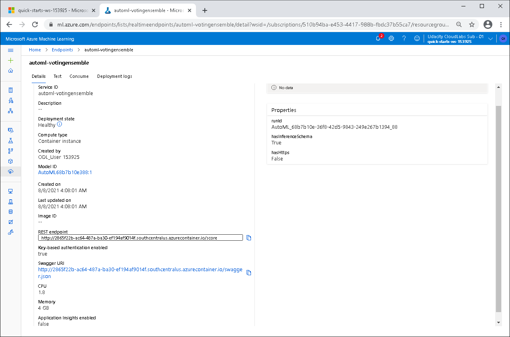

# Operationalizing-Machine-Learning

In this project we use Microsoft Azure Cloud Computing Services to configure a cloud-based machine learning production model, deploy it, and consume it. We will also create, publish, and consume a pipeline. 

The dataset used to train the ML model consists of Bank Marketing data and can be found [here](https://automlsamplenotebookdata.blob.core.windows.net/automl-sample-notebook-data/bankmarketing_train.csv).

## Architectural Diagram
The figure below shows steps that will be implemented in this project:


## Key Steps

### 1. Authentication
In this step, we need to install the Azure Machine Learning Extension which allows us to interact with Azure Machine Learning Studio, part of the `az` command. After having the Azure machine Learning Extension, we create a Service Principal account and associate it with specific workspace. 

**Note**: I am using provided project lab with authentication done, so I skiped this step.

### 2. Automated ML Experiment
In this step, we create an experiment using Automated ML, configure a compute cluster, and use that cluster to run the experiment.
We need to upload the [dataset](https://automlsamplenotebookdata.blob.core.windows.net/automl-sample-notebook-data/bankmarketing_train.csv) to Azure Machine Learning Studio so that it can be used when training the model.

**Registered Datasets**

We need to upload the `bankmarketing_train.csv` dataset into Azure ML Studio before we can use AutoML to train different ML models.  


Next we create a new Automated ML experiment, name it `automl-experiment-bank-marketing`, specify `y` as the target column from the dataset. We also need to create new compute cluster, for example using virtual machine `Standard_DS12_v2` and select minimum number of nodes to `1`.


In `Configure run` section we select task type to `Classification` and check the `Explain best model` option. On `Exit criterion`, set `Training job time` to `1` hour and on `Concurency` set `Max. concurent iterations` to `5`.


**AutoML Experiment Running**


**AutoML Experiment Completed**


**Best Model**

The above figure showed Best Model Summary and the figure below shows some of the metrics of the best model from AutoML.


### 3. Deploy the best model
After the experiment run completes, the Best Model will be selected for deployment. Deploying the Best Model will allow to interact with it through the HTTP API service by sending data over POST requests.

The Best Model is shown in the Details tab and it will also come up in the Models tab at the top. 

**Deploying the Best Model**


**Deployed Best Model**

The Best Model is deployed with Authentication enabled using Azure Container Instance (ACI) 


**Endpoint**

After the model is deployed, Endpoint and Swagger URI were created. This can be seen in the Endpoint tab. We can notice that the Application Insights hasn't been created yet and this is what we will do next.




### 4. Enable logging
Now that the Best Model is deployed, enable Application Insights and retrieve logs. Although this is configurable at deploy time with a check-box, it is useful to be able to run code that will enable it for us. Here is a snippet of the code:

```python
from azureml.core import Workspace
from azureml.core.webservice import Webservice

# Requires the config to be downloaded first to the current working directory
ws = Workspace.from_config()

# Set with the deployment name
name = "automl-votingensemble"

# load existing web service
service = Webservice(name=name, workspace=ws)

service.update(enable_app_insights=True)

logs = service.get_logs()

for line in logs.split('\n'):
    print(line)
```

Prior to running the `logs.py` script, make sure to download and store the `config.json` file in the same folder.

**Application Insights Enabled**

The figure below shows that Application Insights is enabled in the Detail tab of the endpoint with url provided:


**Logs from logs.py script**

The next figure shows the output from the logs.py script that enables the Application Insights among other logs information:


### 5. Swagger Documentation

Swagger is an Interface Description Language for describing RESTful APIs expressed using JSON. Swagger is used together with a set of open-source software tools to design, build, document, and use RESTful web services.

In order to cosume the deployed model using Swagger, Azure provides a Swagger JSON file for deployed models. We can find and download it from the Endpoints section under the deployed model.

**Default Swagger page**


**Swagger Model Documentation**


**API Methods of the Model**


### 6. Consume model endpoints
Now it's time to interact with the deployed model and to test it, we use the `endpoint.py` script to call the trained model and feeding it with some test data. Before we run the script, we need to modify both the `scoring_uri` and the `key` to match the key for our service and the URI that was generated after deployment. This URI can be found in the Details tab, above the Swagger URI.

**Consuming Model Endpoints**

This shows that the `endpoint.py` script runs against the API producing JSON output from the model:


### 7. Create and publish a pipeline
For this part of the project, we use a Jupyter Notebook to create and publish a pipeline. This notebook demonstrates the use of AutoMLStep in Azure Machine Learning Pipeline.
The notebook uses Python SDK to do the following:

- Create an Experiment in an existing Workspace.
- Create or Attach existing AmlCompute to a workspace.
- Define data loading in a TabularDataset.
- Configure AutoML using AutoMLConfig.
- Use AutoMLStep
- Train the model using AmlCompute
- Explore the results.
- Test the best fitted model.

In order to use the notebook we must make sure to have the same keys, URI, dataset, cluster, and model names already created

**Created Pipeline**


**Pipeline Endpoint**


**Bankmarketing dataset with AutoML module**


**Published Pipeline Overview**


**RunDetails Widget**


**Scheduled/Running Pipeline**


## Screen Recording
This [screencast](https://update_link) shows the entire process of the working ML application.

## Future Improvements


